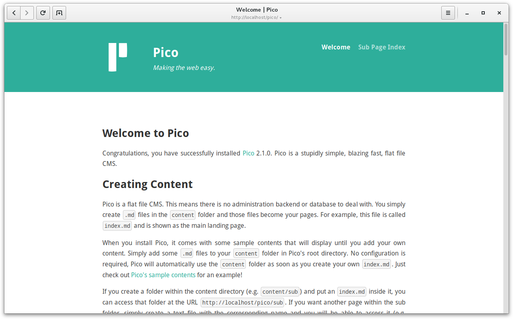

<!--
N.B.: This README was automatically generated by https://github.com/YunoHost/apps/tree/master/tools/README-generator
It shall NOT be edited by hand.
-->

# Pico pour YunoHost

[](https://dash.yunohost.org/appci/app/pico)    
[](https://install-app.yunohost.org/?app=pico)

*[Read this readme in english.](./README.md)*

> *Ce package vous permet d'installer Pico rapidement et simplement sur un serveur YunoHost.
Si vous n'avez pas YunoHost, regardez [ici](https://yunohost.org/#/install) pour savoir comment l'installer et en profiter.*

## Vue d'ensemble

Pico is a stupidly simple, blazing fast, flat file CMS. That’s definitely a mouthful, what does it even mean? In the most basic sense, it means that there is no administration backend or database to deal with. You simply create markdown files in the content folder and those files become your pages. There’s much more to Pico than that though.

**Version incluse :** 3.0.0~ynh1

**Démo :** https://demo.example.com

## Captures d'écran




## Documentations et ressources

* Site officiel de l'app : <https://picocms.org/>
* Documentation officielle de l'admin : <https://picocms.org/docs/>
* Dépôt de code officiel de l'app : <https://github.com/picocms/Pico>
* Documentation YunoHost pour cette app : <https://yunohost.org/app_pico>
* Signaler un bug : <https://github.com/YunoHost-Apps/pico_ynh/issues>

## Informations pour les développeurs

Merci de faire vos pull request sur la [branche testing](https://github.com/YunoHost-Apps/pico_ynh/tree/testing).

Pour essayer la branche testing, procédez comme suit.

``` bash
sudo yunohost app install https://github.com/YunoHost-Apps/pico_ynh/tree/testing --debug
ou
sudo yunohost app upgrade pico -u https://github.com/YunoHost-Apps/pico_ynh/tree/testing --debug
```

**Plus d'infos sur le packaging d'applications :** <https://yunohost.org/packaging_apps>
