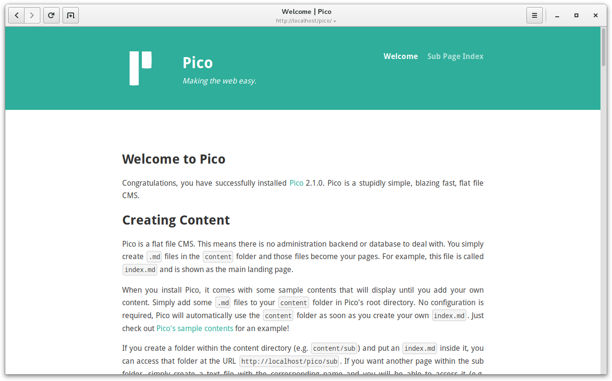

<!--
注意：此 README 由 <https://github.com/YunoHost/apps/tree/master/tools/readme_generator> 自动生成
请勿手动编辑。
-->

# YunoHost 的 Pico

[](https://dash.yunohost.org/appci/app/pico)  

[](https://install-app.yunohost.org/?app=pico)

*[阅读此 README 的其它语言版本。](./ALL_README.md)*

> *通过此软件包，您可以在 YunoHost 服务器上快速、简单地安装 Pico。*  
> *如果您还没有 YunoHost，请参阅[指南](https://yunohost.org/install)了解如何安装它。*

## 概况

Pico is a stupidly simple, blazing fast, flat file CMS. That’s definitely a mouthful, what does it even mean? In the most basic sense, it means that there is no administration backend or database to deal with. You simply create markdown files in the content folder and those files become your pages. There’s much more to Pico than that though.

**分发版本：** 3.0.0~ynh2

## 截图



## 文档与资源

- 官方应用网站： <https://picocms.org/>
- 官方管理文档： <https://picocms.org/docs/>
- 上游应用代码库： <https://github.com/picocms/Pico>
- YunoHost 商店： <https://apps.yunohost.org/app/pico>
- 报告 bug： <https://github.com/YunoHost-Apps/pico_ynh/issues>

## 开发者信息

请向 [`testing` 分支](https://github.com/YunoHost-Apps/pico_ynh/tree/testing) 发送拉取请求。

如要尝试 `testing` 分支，请这样操作：

```bash
sudo yunohost app install https://github.com/YunoHost-Apps/pico_ynh/tree/testing --debug
或
sudo yunohost app upgrade pico -u https://github.com/YunoHost-Apps/pico_ynh/tree/testing --debug
```

**有关应用打包的更多信息：** <https://yunohost.org/packaging_apps>
